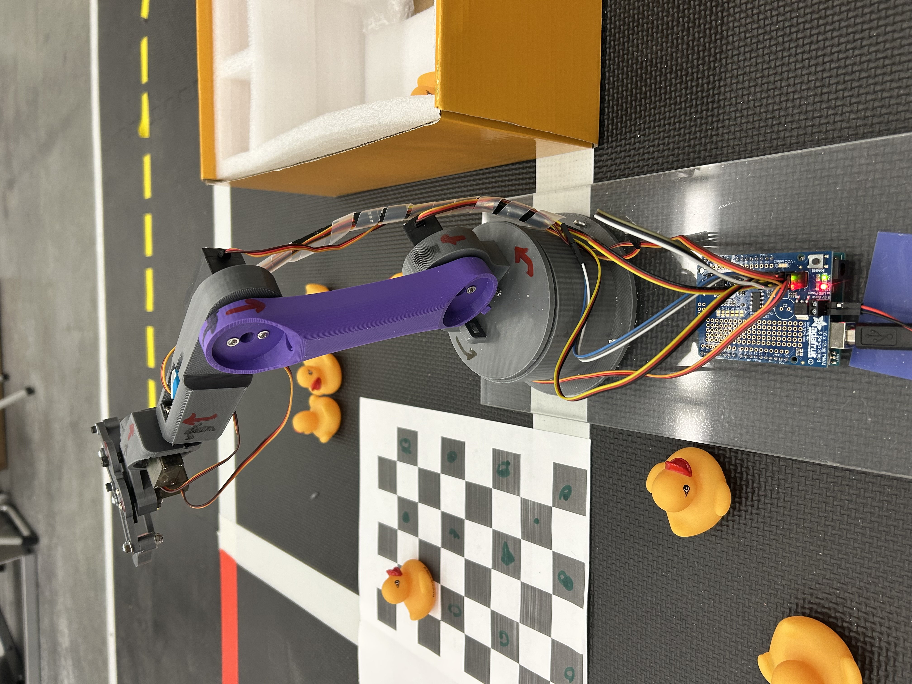
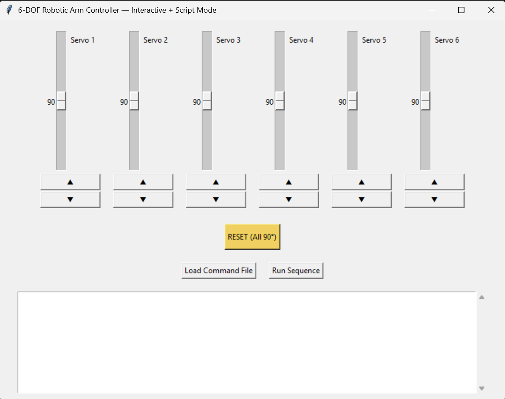
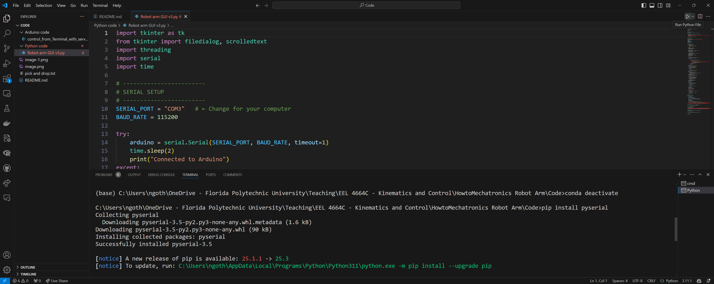
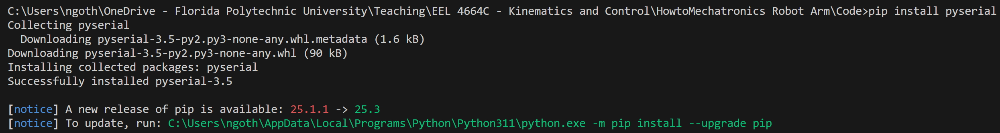
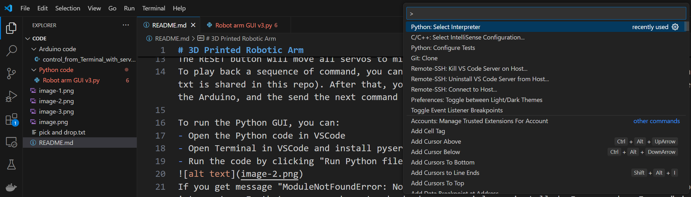
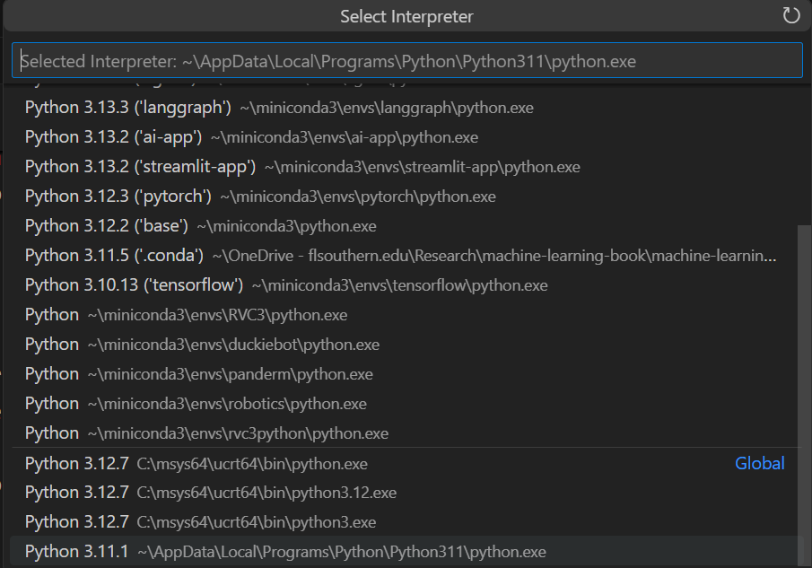

# 3D Printed Robotic Arm

This robotic arm was 3D printed using the design shared in this HowtoMechatronics link https://howtomechatronics.com/tutorials/arduino/diy-arduino-robot-arm-with-smartphone-control/

To control the arm, the author developed an MIT App Inventor app.

In theory, you can run the app on Android phone, iOS phone (https://appinventor.mit.edu/explore/ai2/setup-device-wifi), or using Emulator on PC (https://appinventor.mit.edu/explore/ai2/setup-emulator)

I don't have an Android and I couldn't find a way to run the app on my Iphone and got an error when I was trying to install the Emulator.

So I made an Python GUI with sliders to control the arm (code is in Python code folder).

The Python GUI runs on a computer. Whenever user move a slider and release the mouse, the Python GUI sends a command to the Arduino UNO via COM port.

The Arduino UNO (code is in Arduino code folder) receives the command and control the 6 servos via a Adafruit 16 channel servo driver https://learn.adafruit.com/adafruit-16-channel-pwm-slash-servo-shield

Once finish, the Arduino send back to the Python GUI the current position of the servos and a message "OK".

You can finely adjust the servos' positions by using the up and down buttons below each slider.

The RESET button will move all servos to mid position (90 degree) and the arm will point straight up.

https://www.youtube.com/watch?v=YEi6yk-oYfM

To play back a sequence of command, you can press "Load Command File" and choose a text file containing a sequence of command (a sample sequence named pick and drop.txt is shared in this repo). After that, you press "Run Sequence" and the Python GUI will send the commands, one-by-one, to the Arduino, wait for "OK" message from the Arduino, and the send the next command until finish.

To run the Python GUI, you can:
- Open the Python code in VSCode. Change the SERIAL_PORT variable to the appropriate COM port number. For my case SERIAL_PORT = "COM3"
- Open Terminal in VSCode and install pyserial using "pip install pyserial" (you only need to do this once).
- Run the code by clicking "Run Python file" button in the top right corner.

If you get message "ModuleNotFoundError: No module named 'serial'", maybe you have multiple version of Python and pyserial was installed in a different Python interpreter.

In that case, you have to check where pyserial was installed. For me, when I ran "pip install pyserial", I got the below message

So I know that pyserial was installed for Python311.
Therefore, I go to Help -> Show All Commands -> Python: Select Interpreter

And select the Python 3.11.1

